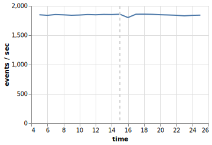
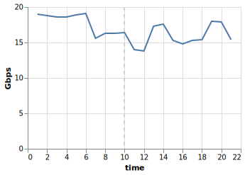

# A. VM Setup Description

The experiments throughout this document were all done in a custom environment on my local machine.
There are two "hosts"[^1], analogous to host 1 and host 2 mentioned in the tutorial slides,
which are themselves containers running under the LXC container runtime.
The QEMU guest virtual machine to be live-migrated runs within these containers.
To make things simple (and lightweight),
both hosts and the guest are running the Alpine Linux distribution.
The following steps were taken to setup the environment and the VM.

[^1]: All uses of the word "host" in this document, unless otherwise specified,
    are referring to *host 1* and *host 2* running as containers on the actual host.

1. Launch containers.

    ```sh
    lxc launch images:alpine/3.15 host1
    lxc launch images:alpine/3.15 host2
    ```

2. Add a shared mount[^2] (where the VM disk image is to be put) and passthrough the KVM device to both hosts.

    ```sh
    lxc storage volume create default nfs
    lxc config device add host1 nfs disk \
        pool=default source=nfs path=/mnt/nfs
    lxc config device add host2 nfs disk \
        pool=default source=nfs path=/mnt/nfs
    lxc config device add host1 kvm unix-char path=/dev/kvm
    lxc config device add host2 kvm unix-char path=/dev/kvm
    ```

3. Configure bridge and TAP interfaces in both hosts.
   To do so, edit `/etc/network/interfaces` like this.

    ```
    auto tap0 inet manual
            pre-up tunctl -t tap0
    
    auto br0
    iface br0 inet dhcp
            bridge-ports eth0 tap0
            bridge-stp 0
    
    hostname $(hostname)
    ```

    Run `rc-service networking restart` to reload.

4. Launch QEMU to perform VM installation.
    Here the `-curses` option is used to show the TTY in a curses-based interface inside the terminal.
    This avoids the headaches of doing VNC and X11 forwarding[^3].

    ```sh
    qemu-system-x86_64 -cpu host -enable-kvm -m 1G -smp 1 \
        -drive if=virtio,format=raw,file=/mnt/nfs/alpine.img \
        -boot d -cdrom alpine-virt-3.15.4-x86_64.iso \
        -curses -nographic \
        -netdev tap,id=tap0,ifname=tap0,script=no,downscript=no \
        -device virtio-net-pci,netdev=tap0
    ```

    Installation is straightforward:

    1. Login on TTY as `root`.
    2. Run `setup-alpine`.
    3. Accept the default settings all the way down.  Set root password.
    4. Select `vda` as the target with the `sys` disk mode.
    5. Reboot.

    Additionally, change `/etc/ssh/sshd_config` to allow root login.

5. The VM is now in good shape and ready to perform live migration experiments.

[^2]: It is impossible to have NFS mounts in unprivileged LXC containers,
    since NFS has no support for user namespaces.
    To work around this issue, a shared volume is used to mimic the setup from the slides.

[^3]: My machine is on Wayland, which complicates X11 forwarding even more.


# B. CPU Performance with and without KVM Enabled

As background information, the data is obtained on a laptop running NixOS with a R7-4750U processor.
Sysbench are ran for 10 seconds (with the default options) on all configurations.

- On guest **with** KVM enabled: 18678 events
- On guest **without** KVM enabled: 3621 events
- On host: 18651 events

The guest VM runs over 5 times slower with KVM disabled.
This is caused by the fact that without KVM,
the QEMU process has no access to the virtulization features provided by the kernel module,
and thus having to rely on emulation by software.
In contrast, the guest with KVM enabled performs almost identical to the host machine.


# C. Network Performance with and without Virtio

The `iperf` server instance is hosted on the actual host (and not on the LXC containers).

The result with virtio:

```
[  5] 0.00-10.00 sec 19.0 GBytes 16.3 Gbits/sec 0 sender
[  5] 0.00-10.00 sec 19.0 GBytes 16.3 Gbits/sec   receiver
```

The result without virtio:

```
[  5] 0.00-10.01 sec 970 MBytes 813 Mbits/sec 0 sender
[  5] 0.00-10.01 sec 970 MBytes 813 Mbits/sec   receiver
```

From the figures, we can see that the network throughput with virtio is over 20 times faster than the other setup.

QEMU defaults to emulating the `e1000` network device for the guest,
which uses the *full virtualization* technique.
In contrast, the Virtio device uses the *para-virtualization* technique,
which requires the guest to be aware that it's a VM and to use that virtio drivers to talk to the host.
The para-virtualized drivers are designed to reduce the number of switches between the VM and the VMM,
thus achieving much better performance.

---

Out of curiosity, I also tested the network performance with the `-R` (reverse) option,
where the server sends and the client receives.

The reversed result with virtio:

```
[  5] 0.00-10.00 sec 21.1 GBytes 18.2 Gbits/sec 0 sender
[  5] 0.00-10.00 sec 21.1 GBytes 18.2 Gbits/sec   receiver
```

The reversed result without virtio:

```
[  5] 0.00-10.00 sec 2.95 GBytes 2.53 Gbits/sec 0 sender
[  5] 0.00-10.00 sec 2.94 GBytes 2.53 Gbits/sec   receiver
```

The interesting part is that the reversed result of e1000 significantly higher than the normal one
(813 Mbits/sec versus 2.53 Gbits/sec).
As of the time of writing, I still have not found any satisfying explanation of this phenomenon.


# D. `iperf` and `sysbench` Measurements During Migration


## `sysbench` Part

The experiment is done by running the following POSIX shell script in the guest during migration.

```sh
while true; do
    TS=$(date +%H:%M:%S)
    PERF=$(sysbench cpu run --time=1 | awk '/events \(avg\/stddev\)/ { printf $3 }');
    echo $TS $PERF
done
```

The result is shown as the line chart below,
with the vertical dashed line marking the beginning of live migration.
Live migration introduces a very marginal but still noticeable performance hit.
During the second when live migration happened,
the number of events dropped to $97.6\%$ of the average.




## `iperf` Part

The result is shown as the line chart below,
with the vertical dashed line marking the beginning of live migration.
During the second when live migration happened,
the network speed observed by `iperf` temporarily dropped by $10\%$.




# E. Live Migration

Live migration is the process of moving virtual machines from one physical machine to another,
without affecting the programs executing inside the virtual machine.
The need of live migration stems from data center use cases.
For example, when a physical machine is broken, the VM's running on top of the machine can be
safely and seamlessly transfered to another physical machine,
without interrupting the services ran by the clients.
Other than hardware maintainance, live migration is also used for power saving.
Migrating virtual machines scattered on several physical machines to one may reduce power usage.


# F. Maintaining Network Connection in Live Migration

In this experiment, the network connection is not dropped during the live migration,
because the migration is done *within* the same subnet[^4],
and both hosts provide the guest with access to the subnet.

Since the guest stays within the same subnet,
the IP obtained by DHCP is still valid,
thus making the SSH session alive across the migration.

[^4]: Being under the same subnet is actually a hard requirement as per KVM documentation.
    See <https://www.linux-kvm.org/page/Migration>.


# G. COLO

#### What is fault-tolerance in cloud system and why we require it?

Fault tolerance refers to the ability of a system to keep functioning regardless of faults.
Cloud systems requires fault-tolerance to be robust against hardware failures, software failures,
network resource congestions, and all other kinds of possible faults,
in order to avoid service outages.

#### What are the relationships between live migration and fault-tolerance?

Live migration is a feature designed for typical operational usage,
while fault-tolerance features are designed with disasters in mind.
In terms of KVM live migration and COLO,
the former only requires the destination host to be up running during the migration timespan,
while the later requires the "destination host" to be up constantly in order to provide replication
in case one of the hosts gets problems.


---

# Appendix: Raw Command Outputs

## `sysbench` During Migration

```
22:55:05 1848.0000/0.00
22:55:06 1839.0000/0.00
22:55:07 1852.0000/0.00
22:55:08 1847.0000/0.00
22:55:09 1840.0000/0.00
22:55:10 1844.0000/0.00
22:55:11 1852.0000/0.00
22:55:12 1848.0000/0.00
22:55:13 1854.0000/0.00
22:55:14 1852.0000/0.00
22:55:15 1858.0000/0.00
# migration starts
22:55:16 1801.0000/0.00
22:55:17 1858.0000/0.00
22:55:18 1859.0000/0.00
22:55:19 1856.0000/0.00
22:55:20 1849.0000/0.00
22:55:21 1845.0000/0.00
22:55:22 1840.0000/0.00
22:55:23 1830.0000/0.00
22:55:24 1839.0000/0.00
22:55:25 1842.0000/0.00
```

## `iperf` During Migration

```
[ ID] Interval         Transfer    Bitrate        Retr Cwnd
[  5]   0.00-1.00  sec 2.21 GBytes 19.0 Gbits/sec 0  3.02 MBytes
[  5]   1.00-2.00  sec 2.19 GBytes 18.8 Gbits/sec 0  3.02 MBytes
[  5]   2.00-3.00  sec 2.16 GBytes 18.6 Gbits/sec 0  3.02 MBytes
[  5]   3.00-4.00  sec 2.17 GBytes 18.6 Gbits/sec 0  3.02 MBytes
[  5]   4.00-5.00  sec 2.19 GBytes 18.9 Gbits/sec 0  3.02 MBytes
[  5]   5.00-6.00  sec 2.23 GBytes 19.1 Gbits/sec 0  3.02 MBytes
[  5]   6.00-7.00  sec 1.82 GBytes 15.6 Gbits/sec 0  3.02 MBytes
[  5]   7.00-8.00  sec 1.90 GBytes 16.3 Gbits/sec 0  3.02 MBytes
[  5]   8.00-9.00  sec 1.90 GBytes 16.3 Gbits/sec 0  3.02 MBytes
[  5]   9.00-10.00 sec 1.90 GBytes 16.4 Gbits/sec 0  3.02 MBytes
[  5]  10.00-11.00 sec 1.63 GBytes 14.0 Gbits/sec 0  3.02 MBytes
[  5]  11.00-12.00 sec 1.61 GBytes 13.8 Gbits/sec 0  3.02 MBytes
[  5]  12.00-13.00 sec 2.01 GBytes 17.3 Gbits/sec 0  3.02 MBytes
[  5]  13.00-14.00 sec 2.05 GBytes 17.6 Gbits/sec 0  3.02 MBytes
[  5]  14.00-15.00 sec 1.78 GBytes 15.3 Gbits/sec 0  3.02 MBytes
[  5]  15.00-16.00 sec 1.72 GBytes 14.8 Gbits/sec 0  3.02 MBytes
[  5]  16.00-17.00 sec 1.78 GBytes 15.3 Gbits/sec 0  3.02 MBytes
[  5]  17.00-18.00 sec 1.79 GBytes 15.4 Gbits/sec 0  3.02 MBytes
[  5]  18.00-19.00 sec 2.09 GBytes 18.0 Gbits/sec 0  3.02 MBytes
[  5]  19.00-20.00 sec 2.08 GBytes 17.9 Gbits/sec 0  3.02 MBytes
[  5]  20.00-21.00 sec 1.79 GBytes 15.4 Gbits/sec 0  3.02 MBytes
- - - - - - - - - - - - - - - - - - - - - - - - -
[ ID] Interval         Transfer    Bitrate         Retr
[  5]   0.00-21.00 sec 41.0 GBytes 16.8 Gbits/sec 0 sender
[  5]   0.00-21.03 sec 41.0 GBytes 16.8 Gbits/sec   receiver
```
